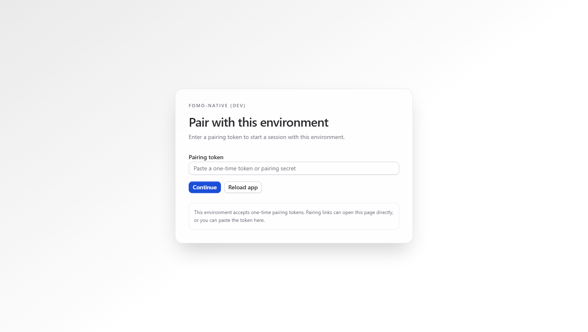
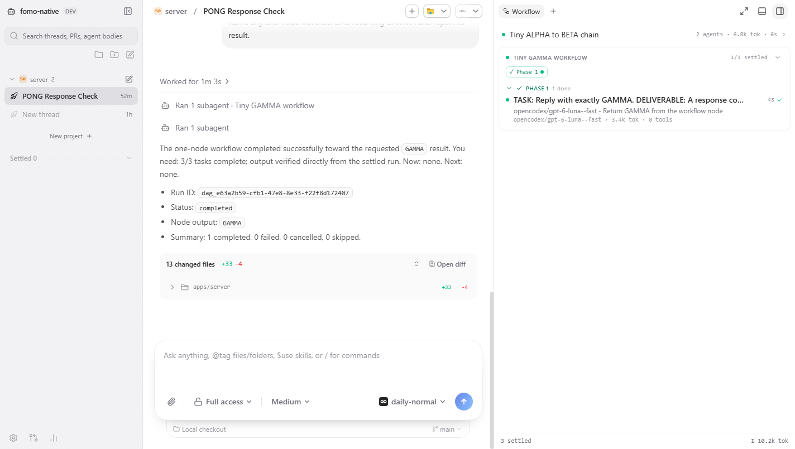
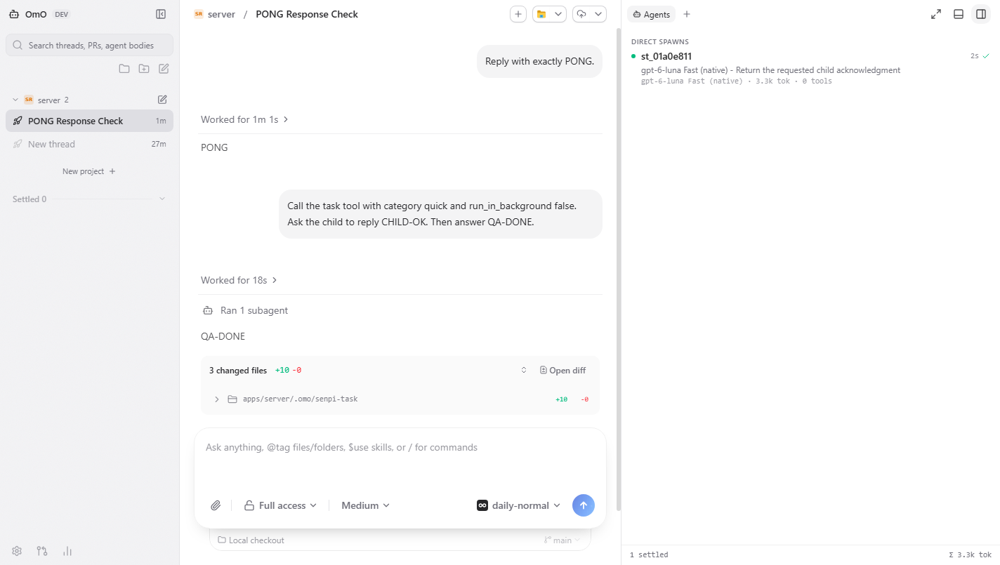

# fomo-native

**An unofficial native desktop client for OmO, built while waiting for OmO native. FOMO won.**

> [!IMPORTANT]
> **fomo-native is an independent community project.** It is not affiliated with,
> sponsored by, endorsed by, or supported by the maintainers of
> [oh-my-openagent](https://github.com/code-yeongyu/oh-my-openagent), OmO, or
> [T3 Code](https://github.com/pingdotgg/t3code).

## Why this exists

I use OmO, I am a fan of oh-my-openagent, and I wanted a native desktop home for
the conversations, agents, and workflow activity already running on my machine.
While waiting for an official native OmO experience, I built the client I wanted
to open every day.

The name is a small joke, not a complaint: **OmO + FOMO = fomo-native**. This
project is shared with appreciation for the people building OmO and for the T3
Code team whose open-source desktop application made this experiment possible.

`v0.0.1` is an early Windows release. Expect rough edges.

## Screenshots

### Native OmO workspace



### Workflow activity



### Agents at work



## What works today

- Local OmO sessions over `omo --mode rpc --multi-session`
- Automatic detection of an installed `omo` executable
- OmO model and profile discovery from the local installation
- Project and thread navigation in a native desktop window
- Streaming conversations with model, reasoning, and permission controls
- Agent and workflow activity panels with status, timing, token, and tool usage
- Integrated terminal, file changes, diffs, and source-control surfaces
- Desktop notifications and taskbar activity on Windows

The Workflow panel currently presents runs as phases and agent rows. A true
node-to-node dependency graph is planned, but it is **not** part of `v0.0.1`.

## Requirements

- Windows x64 for the `v0.0.1` installer
- [OmO / oh-my-openagent](https://github.com/code-yeongyu/oh-my-openagent)
  installed locally and available as `omo` in your user environment

Check your OmO installation before launching fomo-native:

```powershell
omo --version
```

fomo-native does not install, bundle, or replace OmO. Your subscriptions,
provider credentials, models, and profiles continue to be managed by OmO.

## Install the Windows release

1. Open the [`v0.0.1` release](https://github.com/Liruns/fomo-native/releases/tag/v0.0.1).
2. Download `fomo-native-0.0.1-windows-x64.exe` and `SHA256SUMS`.
3. Verify the installer:

   ```powershell
   Get-FileHash .\fomo-native-0.0.1-windows-x64.exe -Algorithm SHA256
   Get-Content .\SHA256SUMS
   ```

4. Run the installer and start **fomo-native** from the Windows Start menu.

The first alpha installer may be unsigned. Windows SmartScreen can therefore
show an **Unknown publisher** warning. Only continue after confirming that the
file came from this repository and that its SHA-256 hash matches the release.

Updates are manual in `v0.0.1`: download and install the next release from
GitHub when it becomes available.

## Run from source

### Prerequisites

- Node.js `^24.13.1`
- pnpm `11.10.0`
- A working local `omo` installation

```powershell
git clone https://github.com/Liruns/fomo-native.git
cd fomo-native
pnpm install --frozen-lockfile
pnpm dev:desktop
```

Useful checks:

```powershell
pnpm --filter @t3tools/desktop typecheck
pnpm --filter t3 typecheck
pnpm --filter @t3tools/web typecheck
```

## Local-first boundaries

The OmO runtime is launched on your machine and communicates with fomo-native
locally. This fork is intended to work with your local projects and existing OmO
configuration. Review the upstream source and this fork before using either
with sensitive repositories; no software can make third-party providers or
tools more private than their own policies allow.

## Roadmap

- Persist exact workflow node IDs and dependency edges
- Render a real read-only DAG with branching, joins, retries, and history
- Keep the current list view for details, legacy runs, and narrow layouts
- Improve packaging, signing, updates, and platform coverage after the Windows
  alpha is stable

## Credits

- **[T3 Code](https://github.com/pingdotgg/t3code)** is the upstream codebase
  this project forks. Its original MIT copyright and license are preserved.
- **[oh-my-openagent](https://github.com/code-yeongyu/oh-my-openagent)** is the
  project behind OmO and the reason this client exists.

See [NOTICE.md](NOTICE.md) for attribution details.

## License

This repository is distributed under the [MIT License](LICENSE). The existing
T3 Code copyright and permission notice remain intact.
